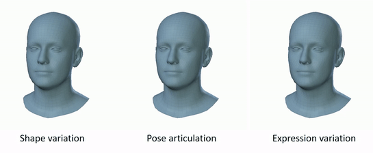

# FLAME: Articulated Expressive 3D Head Model (PyTorch)

This is an implementation of the [FLAME](http://flame.is.tue.mpg.de/) 3D head model in PyTorch.

We also provide [Tensorflow FLAME](https://github.com/TimoBolkart/TF_FLAME), a [Chumpy](https://github.com/mattloper/chumpy)-based [FLAME-fitting repository](https://github.com/Rubikplayer/flame-fitting), and code to [convert from Basel Face Model to FLAME](https://github.com/TimoBolkart/BFM_to_FLAME).

<p align="center"> 

</p>

FLAME is a lightweight and expressive generic head model learned from over 33,000 of accurately aligned 3D scans. FLAME combines a linear identity shape space (trained from head scans of 3800 subjects) with an articulated neck, jaw, and eyeballs, pose-dependent corrective blendshapes, and additional global expression blendshapes. For details please see the following [scientific publication](https://ps.is.tuebingen.mpg.de/uploads_file/attachment/attachment/400/paper.pdf)

```bibtex
Learning a model of facial shape and expression from 4D scans
Tianye Li*, Timo Bolkart*, Michael J. Black, Hao Li, and Javier Romero
ACM Transactions on Graphics (Proc. SIGGRAPH Asia) 2017
```

and the [supplementary video](https://youtu.be/36rPTkhiJTM).

## Installation

The code uses **Python 3.7** and it is tested on PyTorch 1.4.

### Setup FLAME PyTorch Virtual Environment

```shell
python3.7 -m venv <your_home_dir>/.virtualenvs/FLAME_PyTorch
source <your_home_dir>/.virtualenvs/FLAME_PyTorch/bin/activate
```

### Clone the project and install requirements

```shell
git clone https://github.com/soubhiksanyal/FLAME_PyTorch
cd FLAME_PyTorch
python setup.py install
mkdir model
```

## Download models

* Download FLAME model from [here](http://flame.is.tue.mpg.de/). You need to sign up and agree to the model license for access to the model. Copy the downloaded model inside the **model** folder. 
* Download Landmark embedings from [RingNet Project](https://github.com/soubhiksanyal/RingNet/tree/master/flame_model). Copy it inside the **model** folder. 

## Demo

### Loading FLAME and visualising the 3D landmarks on the face

Please note we used the pose dependent conture for the face as introduced by [RingNet Project](https://github.com/soubhiksanyal/RingNet/tree/master/flame_model).

Run the following command from the terminal

```shell
